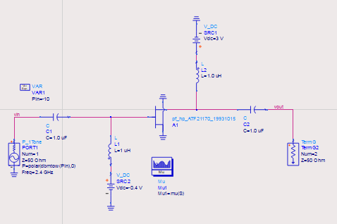
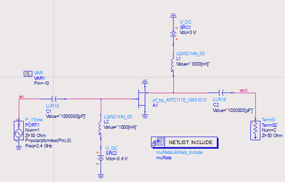
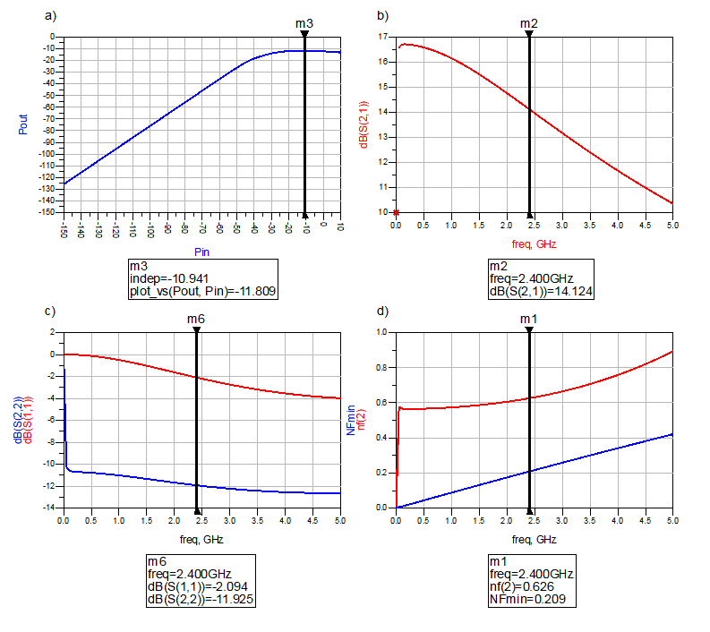
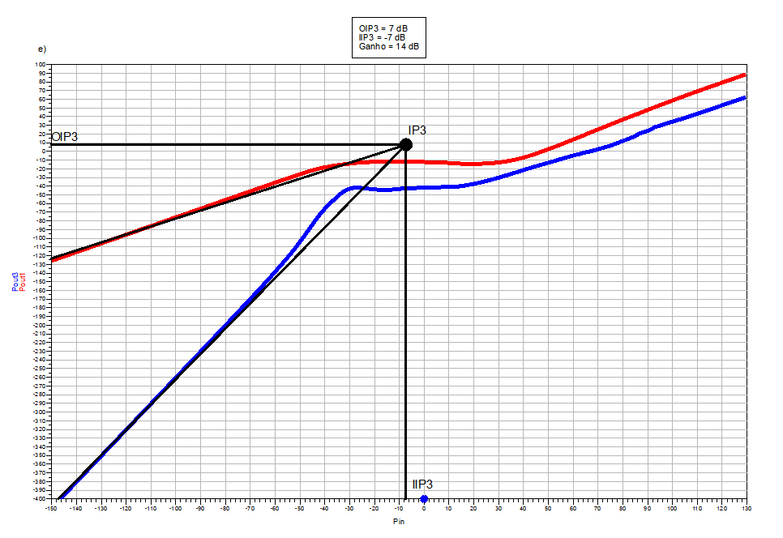
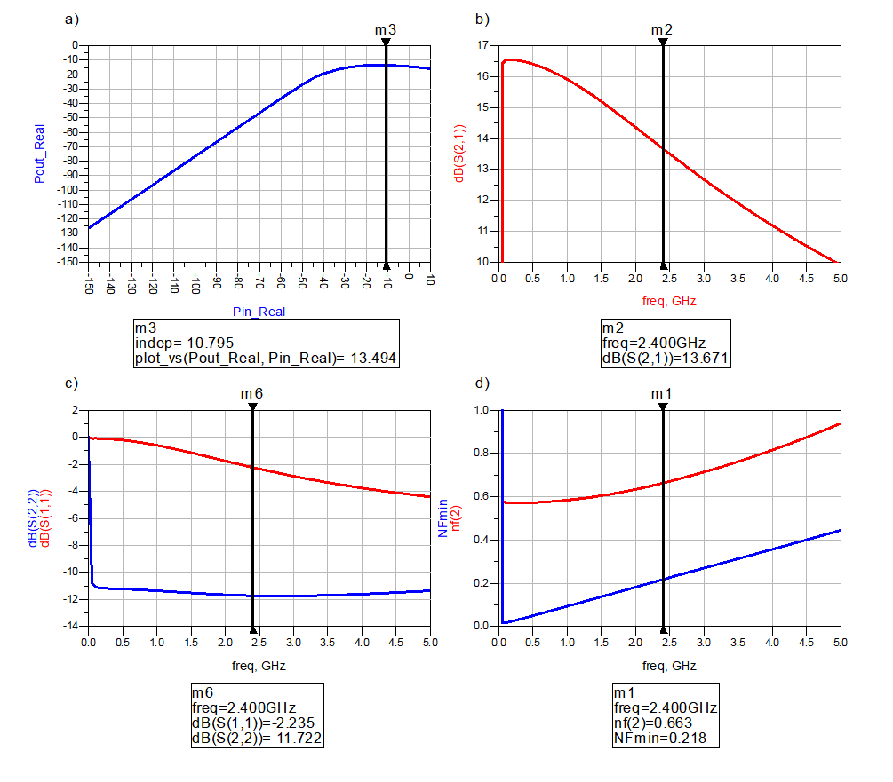
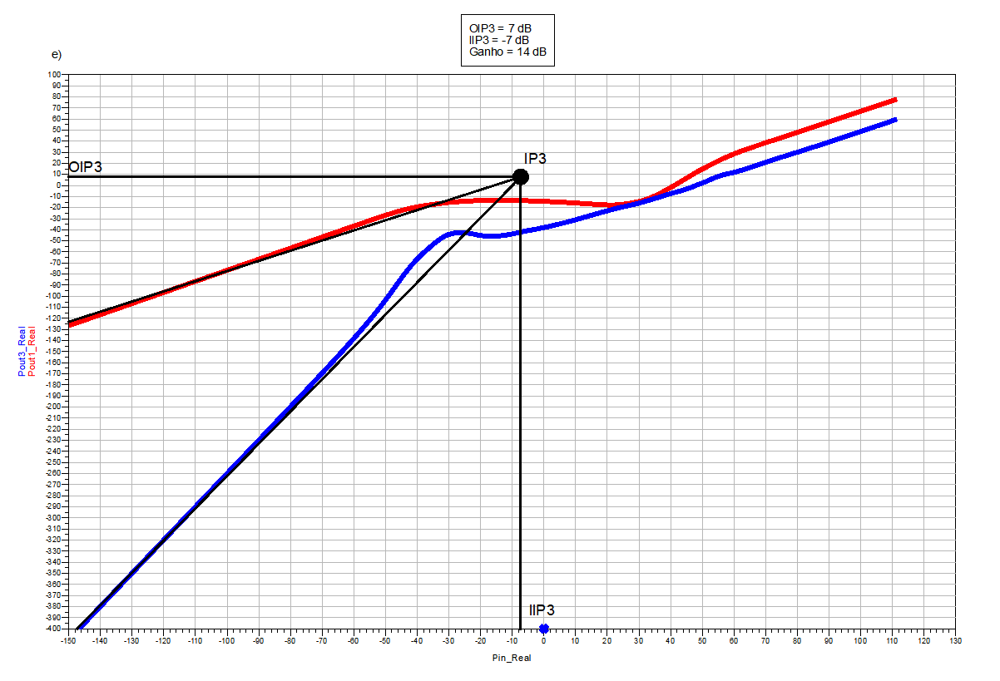

# LNATESTBENCH
## Tarefa desenvolvida para a disciplina de Circuitos de Radiofrequência, do curso de Engenharia Elétrica, UFERSA, Caraúbas, Brasil.
## Docente: Prof. Dr. Francisco de Assis Brito Filho
## Discentes: Jakson dos Santos Silva, José Ailton de Oliveira Júnior, Yago Daniel Souto
## Resumo
Este repositório apresenta a implementação e o tesbench de um circuito amplificador LNA (Low Noise Amplifier) com o uso do software ADS (Advanced Design System) para sua caracterização utilizando componentes comportamental e SMD comerciais. Resultados de simulação de ganho e resposta em frequência, linearidade (P1dB ou IIP3) e ruído (NF) serão desenvolvidos e comparados.
## Introdução
O LNA é o primeiro estágio presente no receptor após a antena captar o sinal de rádio frequência (RF). Este amplificador apresenta a característica de baixo ruído, em que, sua função é amplificar o sinal recebido de modo a evitar ao máximo que o ruído intrínseco do componente venha a alterar o conteúdo da mensagem captada. Com isso, o LNA deve ser projetado de maneira que apresente uma baixa figura de ruído (NF).
Dessa forma, para se obter uma baixa figura de ruído no LNA, é necessário escolher uma topologia simples para implementação, já que cada componente eletrônico é responsável por introduzir ruído ao sistema. Assim, o LNA pode ser baseado em topologia de um estágio, tais como: porta comum, dreno comum ou fonte comum. A topologia porta comum tem a característica de possuir facilidade em ajustar a impedância de entrada para baixos valores resistivos, de modo, a possibilitar um bom casamento de impedância. Contudo, o ajusto dessa impedância resistiva aumenta a figura de ruído do sistema. Já a topologia dreno comum fornece altos valores para a corrente de saída, no entanto, o maior ganho que pode alcançar é o valor unitário, de modo, a inviabilizar o seu uso no projeto de LNA. Para o amplificador fonte comum, a impedância de entrada pode ser ajustada para baixos valores, com característica capacitiva, além de apresentar um alto ganho de tensão na saída. Além disso, pode-se acrescentar uma degeneração indutiva e, consequentemente na entrada surgi uma componente real, que será útil para o casamento de impedância.
## Implementação da tarefa
Primeiramente, foi realizada a implementação do esquemático através do software Advanced Design System - ADS do amplificador LNA (Low Noise Amplifier) utilizando componentes ideais e SMD comerciais, como mostrado nas Figuras 1 e 2, respectivamente. 
#### Figura 1 – Esquemático do circuito amplificador LNA com componentes ideais. Fonte: Autores, 2020.
  
#### Figura 2 - Esquemático do circuito amplificador LNA com componentes SMD comercial. Fonte: Autores, 2020.
  
##
Os circuitos foram projetados para operar numa frequência fundamental de 2,4 GHz. O transistor FET ATF-21170 utilizado foi importado da própria biblioteca do ADS, que no qual o datasheet com os principais parâmetros pode ser consultado através do Link: https://pdf1.alldatasheet.com/datasheet-pdf/view/64591/HP/ATF-21170.html. Na Figura 1, é apresentado o esquemático do circuito LNA com valores projetados em componentes ideais, uma vez que, será necessário realizar uma análise crítica do funcionamento do circuito através dos resultados da simulação de Parâmetros-S, ganho, resposta em frequência e ruído, com os resultados apresentado por meio do esquemático da Figura 2, com componentes SMD comerciais da fabricante Murata, inseridos na biblioteca do software ADS. A seção seguinte apresenta os resultados da simulação de ambos os circuitos implementados.
## TestBench
A primeira parte do TestBench foi realizada utilizando componentes ideais com objetivo de verificar o comportamento do ganho, resposta em frequência, linearidade e ruído.  
Na medida em que o sinal de entrada do amplificador aumenta o sinal de saída também aumenta, contudo, devido a não-linearidade do amplificador o ganho sofre uma compressão quando o amplificador se aproxima da região de saturação, como é visto na Figura 3. a). A simulação do ganho do circuito é realizada através dos parâmetros S usando coeficiente de transmissão direta, parâmetro S21. O gráfico b) da Figura 3 mostra o ganho que o circuito fornece com S21 = 14,124 dB. Para verificar o casamento de saída e entrada, é necessário analisar o coeficiente de reflexão da entrada S11 = -2,094 dB e saída S22 = -11,925 dB que está apresentado gráfico c) da Figura 3. O próximo parâmetro a ser analisado do LNA foi a sua figura de ruído. Para tanto, pode-se aproveitar a simulação de parâmetros S, e clicar em NF para obter a figura de ruído NF = 0,626 dB que está apresentada no gráfico d) da Figura 3.
#### Figura 3 - Gráficos retirados do ADS através simulação do amplificador LNA com componentes ideais. a)Ponto de compressão 1 dB; b)Ganho do LNA, parâmetro S21; c)Coeficiente de reflexão de entrada (S11) e saída (S22); d)Figura de ruído do LNA. Fonte: Autores, 2020. Fonte: Autores, 2020.
  
A análise de linearidade fica por conta do ponto de interceptação de terceira ordem IP3. Nessa simulação é analisado sinal de frequência fundamental junto ao sinal de frequência da terceira harmônica no amplificador, para que se possa observar o comportamento da potência de saída em relação a entrada. Com isso, foi verificado esse comportamento, como é mostrado na Figura 4. Assim, pode-se obter 7 dB para o OIP3, -7 dB para o IIP3 e como resultado para o ganho 14 dB.
#### Figura 4 - Gráfico retirado pelo ADS da linearidade através da simulação do amplificador LNA com componentes ideais. Fonte: Autores, 2020.
  
A segunda parte do TestBench é feita usando componentes SMD comercial seguindo a mesma linha de raciocínio, ou seja, analisar detalhadamente seu comportamento através dos procedimentos aplicados nos gráficos da primeira parte da simulação. Com isso, o ganho do LNA S21 = 13,671 dB pode ser visto no gráfico b), o coeficiente de reflexão na entrada S11 = -2,235 dB e saída S22 = -11,722 dB no gráfico c) e a figura de ruído NF = 0,663 dB no gráfico d) da Figura 5.
#### Figura 5 - Gráficos retirados do ADS através simulação do amplificador LNA com componentes SMD comercial. a)Ponto de compressão 1 dB; b)Ganho do LNA, parâmetro S21; c)Coeficiente de reflexão de entrada (S11) e saída (S22); d)Figura de ruído do LNA. Fonte: Autores, 2020.
  
A análise de linearidade fica por conta do ponto de interceptação de terceira ordem IP3 para simulação do amplificador LNA com componentes SMD comercial. O comportamento de não linearidade do LNA encontra-se na Figura 6 logo abaixo. A análise alcançou os mesmos valores para OIP3, IIP3 e ganho da primeira parte. 
#### Figura 6 - Gráfico retirado pelo ADS da linearidade através da simulação do amplificador LNA com componentes SMD comercial. Fonte: Autores, 2020.
  
Executando uma comparação entre os resultados obtidos nas duas partes pode-se averiguar que o amplificador utilizando componentes SMD comercial apresenta uma degradação nos resultados por consequência da existência de parasitas, uma vez que, na prática é impossível atingir as especificações de componentes ideais. Além disso, é possível perceber que o coeficiente de reflexão da entrada (S11) apresentou um valor próximo de 0 dB, tanto para os componentes ideais como para os comerciais, devido ao descasamento de impedância para a entrada e saída. Assim, o resultado esperado é que o circuito seja inviável, uma vez que transistor será danificado. Na próxima seção será apresentado o casamento de impedância para o circuito do LNA.
## Casamento de impedância
Para o casamento de impedância foi utilizado duas redes L com componetes LC, para entrada e saída. Além do mais, o projeto dessas redes L foi feito com o auxílio da Carta de Smith presente no software ADS e, além disso foi adicionado uma degeneração indutiva na fonte do transistor. Com isso, o circuito com as redes para o casamento de impedância é visto nas Figuras 7 e 8 para os componentes ideais e comerciais, respectivamente.
#### Figura 7 – Esquemático do circuito amplificador LNA para componentes ideais com as redes L de casamento. Fonte: Autores, 2020.
#### Figura 8 – Esquemático do circuito amplificador LNA para componentes SMD comercial com as redes L de casamento. Fonte: Autores, 2020.
O passo seguinte foi simular novamente para os componentes ideais e comerciais a compressão de ganho, o ganho através do S21, o coeficiente de reflexão para entrada S11 e para a saída S22 e a figura de ruído. Na Figura 9 são vistos esses resultados através de gráficos para o circuto com componentes ideais.
#### Figura 9 - Gráficos retirados do ADS através simulação do amplificador LNA com componentes ideais com as redes L de casamento de impedância. a)Ponto de compressão 1 dB; b)Ganho do LNA, parâmetro S21; c)Coeficiente de reflexão de entrada (S11) e saída (S22); d)Figura de ruído do LNA. Fonte: Autores, 2020. Fonte: Autores, 2020.
Como já dito antes, a análise de linearidade fica por conta do ponto de interceptação de terceira ordem IP3, em que, está análise é mostrada na Figura 10 para o circuito com componentes ideais.
#### Figura 10 - Gráfico gerado a partir do ADS para a linearidade através da simulação do amplificador LNA com componentes ideais com as redes L de casamento de impedância. Fonte: Autores, 2020.
A partir dos gráficos vistos na Figura 9 é possível notar uma melhora significativa para o coeficiente de reflexão de saída e entrada, com valores de S11=-19,738 dB e S22=-19,662 dB. Além disso, o ganho caiu para 10,821 dB e 
## Conclusões
Neste trabalho foi abordado o projeto e simulação de amplificador de baixo ruído (LNA), que no qual, foi elaborado um testbench para a caracterização do LNA utilizando componentes comportamentais e componentes comerciais. O testbench teve como resultado a simulação do ganho e resposta em frequência, linearidade (IIP3) e ruído (NF). Com isso, foi observado que na frequência fundamental de 2,4 GHz o ganho foi de 14,124 dB para os componentes ideais e 13,671 dB para os componentes SMD comercial, em que, essa diferença é consequência dos parasitas presente na análise real do circuito. Portanto, esse trabalho foi muito importante para o aprofundamento do projeto e simulação do amplificado LNA, visto que todos os objetivos foram alcançados.
## Referências
ALMEIDA JÚNIOR, Paulo Acés de. PROJETO DE UM AMPLIFICADOR DE BAIXO RUÍDO E DE UM MISTURADOR DE FREQUÊNCIAS PARA UM TRANSCEPTOR ZIGBEE (2.4 GHz). TCC (Graduação) - Curso de Engenharia Eletrônica, Universidade de Brasília, Brasília, 2016.  
RAZAVI. RF Microelectronics. 2nd. Ed. 2011
